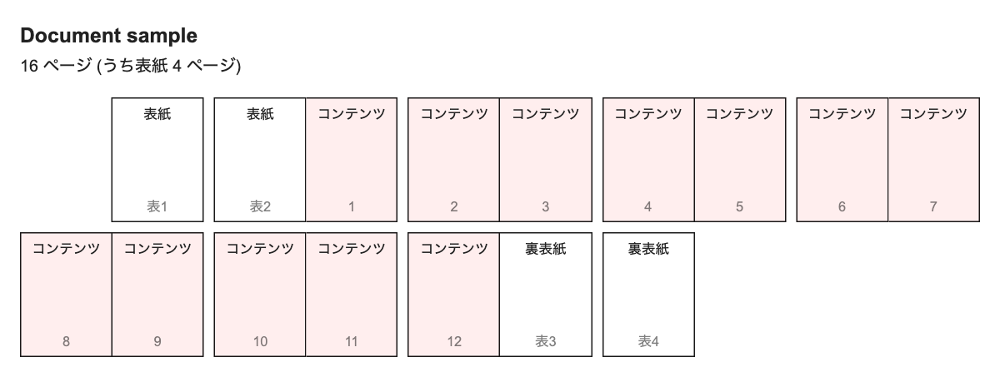

# daiwaru

設定ファイルをもとに、ページ割りを生成するツールです

png と pdf で書き出すことができます



## usage
```sh
git clone git@github.com:kiwi-26/daiwaru.git && cd daiwaru
npm install
node . -f png -o result.png
```

## options
```
Usage: daiwaru [options]

Options:
  -i, --input <file>     input yaml file (default: "sample.yaml")
  -o, --output <file>    output file name (default: "result.pdf")
  -f, --format <format>  file format (choices: "pdf", "png", default: "pdf")
  -h, --help             display help for command
```